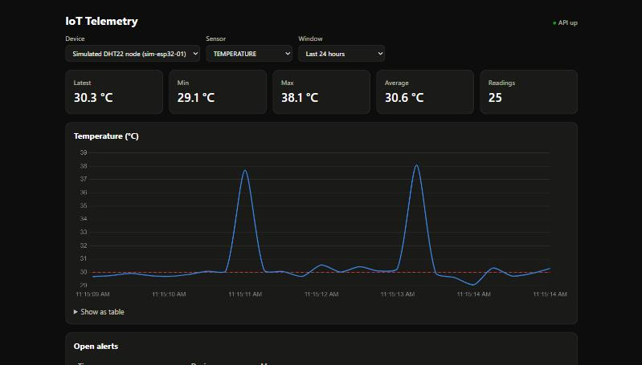
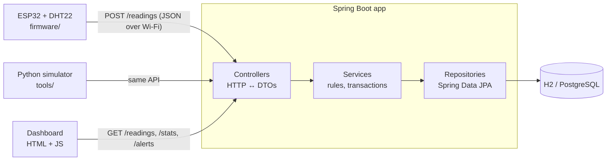

# IoT Telemetry API

[](https://github.com/Devz1505/iot-telemetry-api/actions/workflows/ci.yml)
[](https://github.com/Devz1505/iot-telemetry-api/actions/workflows/firmware.yml)

A Spring Boot REST backend that collects sensor readings from ESP32 boards,
stores them in a SQL database, checks them against per-device threshold rules,
and raises alerts. A small JavaScript dashboard plots the data live.

Built to connect the two halves of my background: **embedded firmware** (ESP32 + DHT22,
C++) and **backend software** (Java, Spring Boot, SQL, REST).





## Features

- **Device registry**: devices register once with a human-readable id (`esp32-lab-01`).
- **Batched ingestion**: one request carries every sensor from a sampling cycle. The batch is
  validated and stored atomically (all or nothing).
- **Sensor-aware validation**: values outside a sensor's physical range (humidity 140 %,
  temperature 300 °C) are rejected as sensor faults. So are timestamps from an unsynced
  device clock that land in the future.
- **Queries**: paginated readings by time window and sensor type, plus min/max/avg/count
  aggregated **in the database** (JPQL), not in Java.
- **Threshold alerts**: per-device, per-sensor min/max rules. A breaking reading raises an
  alert in the same transaction. Alerts can be listed and acknowledged.
- **Consistent errors**: every error is RFC 9457 `application/problem+json`, with
  per-field messages for validation failures.
- **Tests**: 23 tests across unit (JUnit, Mockito), repository (`@DataJpaTest`) and full
  HTTP integration (`@SpringBootTest` + MockMvc). CI runs them on GitHub Actions, and a
  second workflow compiles the ESP32 firmware.
- **Docs**: interactive OpenAPI/Swagger UI generated from the code.

**Stack:** Java 21 · Spring Boot 4 (Web MVC, Data JPA, Validation, Actuator) · Hibernate ·
H2 / PostgreSQL · JUnit 5 · Mockito · MockMvc · springdoc-openapi · JavaScript + Chart.js ·
ESP32 (Arduino C++) · Python · GitHub Actions

## Run it

Needs JDK 21+ and Maven (or use the bundled `mvnw`).

```bash
mvn spring-boot:run
```

Then open:

| URL | What |
|---|---|
| http://localhost:8080 | Live dashboard |
| http://localhost:8080/swagger-ui.html | Try every endpoint in the browser |
| http://localhost:8080/h2-console | Browse the tables (JDBC URL `jdbc:h2:mem:telemetry`, user `sa`) |
| http://localhost:8080/actuator/health | Health check |

In a second terminal, start a fake device so there is data to look at:

```bash
python tools/simulate_device.py
```

### With PostgreSQL instead of in-memory H2

The app connects with its own least-privilege login (`telemetry_app`), never the `postgres`
superuser. One-time setup:

1. Copy the `local.example` folder to `local` (git-ignored). Pick a password and put the
   same value in both `local/db.properties` and `local/setup-db.sql`.
2. Create the login and database. psql asks for the **postgres** superuser password:

   ```bash
   psql -U postgres -h localhost -f local/setup-db.sql
   ```

3. Run with the `postgres` profile. Tables are created on first start:

   ```bash
   mvn spring-boot:run -Dspring-boot.run.profiles=postgres
   ```

`DB_URL`, `DB_USER` and `DB_PASSWORD` environment variables override `local/db.properties`.

### ESP32 firmware

`firmware/esp32_telemetry_client` is an Arduino sketch for an ESP32 with a DHT22 sensor.
The **Firmware** GitHub Actions workflow compiles it against Espressif's ESP32 core on every
change. It has not been run on physical hardware; the Python simulator stands in for a
board and sends the same JSON.

To build it locally: copy `secrets.example.h` to `secrets.h` in the same folder (git-ignored)
and fill in Wi-Fi details and your PC's LAN IP (from `ipconfig`). Then compile with Arduino
IDE or `arduino-cli compile --fqbn esp32:esp32:esp32`. Wiring and libraries are listed at the
top of the sketch.

## API

| Method | Path | Purpose |
|---|---|---|
| `POST` | `/api/devices` | Register a device → `201` + `Location` |
| `GET` | `/api/devices` | List devices |
| `GET` | `/api/devices/{deviceId}` | One device, incl. `lastSeenAt` |
| `POST` | `/api/devices/{deviceId}/readings` | Ingest a batch → `{accepted, alertsRaised}` |
| `GET` | `/api/devices/{deviceId}/readings?sensorType=&from=&to=&page=&size=` | Paged readings, newest first |
| `GET` | `/api/devices/{deviceId}/stats?sensorType=&from=&to=` | count / min / max / avg |
| `PUT` | `/api/devices/{deviceId}/thresholds/{sensorType}` | Set `{min, max}` (either may be null) |
| `GET` | `/api/devices/{deviceId}/thresholds` | List rules |
| `DELETE` | `/api/devices/{deviceId}/thresholds/{sensorType}` | Remove a rule → `204` |
| `GET` | `/api/alerts?acknowledged=` | Alerts, newest first |
| `POST` | `/api/alerts/{id}/acknowledge` | Acknowledge (idempotent) |

Times are ISO-8601 UTC (`2026-09-30T10:15:00Z`); windows default to the last 24 h.
Sensor types: `TEMPERATURE`, `HUMIDITY`, `PRESSURE`, `LIGHT`, `VOLTAGE`.

Example ingest request:

```json
POST /api/devices/esp32-lab-01/readings
{
  "readings": [
    { "sensorType": "TEMPERATURE", "value": 27.4, "recordedAt": "2026-09-30T10:15:00Z" },
    { "sensorType": "HUMIDITY",    "value": 61.0 }
  ]
}
```

`recordedAt` is optional; boards without NTP can omit it and the server timestamps the reading.

Example error:

```json
{ "status": 400, "title": "Bad Request",
  "detail": "readings[1]: HUMIDITY value 140.0 is outside the plausible range 0.0 to 100.0 %RH (sensor fault?)" }
```

## Tests

```bash
mvn verify
```

| Test | Level | What it proves |
|---|---|---|
| `ThresholdRuleTest` | Unit | Alert rule logic: bounds, open-ended rules, messages |
| `AlertServiceTest` | Unit + Mockito | Only violating readings raise alerts; bad rules rejected before any DB call |
| `ReadingRepositoryTest` | `@DataJpaTest` | JPQL aggregates, half-open time windows, paging order |
| `TelemetryApiIntegrationTest` | Full HTTP + DB | Status codes, validation errors, atomic batches, alert → acknowledge flow |

## Project layout

```
src/main/java/com/devavrat/telemetry/
  controller/   HTTP endpoints only: parse request, call service, return DTO
  service/      Business rules and transaction boundaries
  repository/   Spring Data JPA interfaces + JPQL queries
  domain/       JPA entities (Device, Reading, ThresholdRule, Alert) and SensorType
  dto/          Request/response records: the API contract, separate from entities
  exception/    Domain exceptions + global problem+json handler
src/main/resources/static/   Dashboard (HTML/CSS/JS)
firmware/                    ESP32 Arduino sketch
tools/                       Python device simulator
```

## Design notes

- **DTOs separate from entities**, so the database schema can change without breaking
  devices already in the field.
- **`open-in-view` disabled**: all database access happens inside service transactions,
  so lazy-loading mistakes fail loudly in tests instead of adding hidden queries.
- **Composite index** `(device_id, sensor_type, recorded_at)` matches the hottest query.
- **Half-open windows `[from, to)`**: back-to-back windows never double-count a reading.

## Roadmap

- [ ] Per-device API keys so only registered boards can post readings
- [ ] Alert hysteresis: one alert per excursion, not one per reading
- [ ] Offline buffering in the device client, replayed with original timestamps
- [ ] Flyway migrations instead of `ddl-auto`
- [ ] Docker Compose (app + PostgreSQL) and a Testcontainers test
